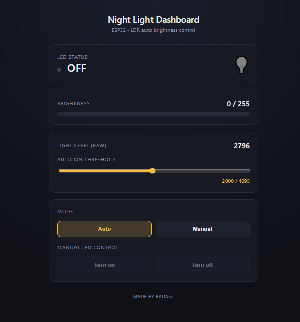

# Night Light AI IoT Project

This repository contains a simple Internet of Things (IoT) project that combines an ESP32-based night light with an AI-enabled control layer. The main idea is to show how a physical device can be controlled through natural language by connecting an LLM to the ESP32 over a small tool-based interface.

## Overview

The project is split into two main parts:

1. An ESP32 firmware project that controls an LED based on ambient light and exposes a small web dashboard and HTTP endpoints.
2. An MCP-based local AI workflow that gives an LLM access to tools for reading and controlling the ESP32 through those endpoints.

Together, these parts form a basic but practical example of AI-enabled IoT: the user can interact with the hardware using natural language instead of directly sending commands to the device.

## ESP32 night light

The ESP32 project is responsible for the physical device behavior. It reads light levels from an LDR sensor, adjusts LED brightness automatically in auto mode, and can also be switched to manual mode for direct control. It serves a local web interface and exposes endpoints for status, mode changes, threshold updates, and brightness control.

This part of the project is documented in the ESP32 folder README.

## AI control layer

The MCP project adds an AI layer on top of the ESP32. It exposes tools to an LLM, allowing the model to inspect the device state and issue commands such as turning the LED on or off, switching between auto and manual modes, reading brightness, and adjusting thresholds. The system is designed to work with a locally run model through llama.cpp, which keeps the experience lightweight and mostly self-contained.

This part of the project is documented in the MCP folder README.

## What makes this project interesting

Although it is a basic example, the project demonstrates a few important concepts:

- IoT device control through embedded firmware
- Local web control and API-based interaction
- Tool use by an LLM to interact with hardware
- Natural-language control of a physical device in a home-automation context

## Project structure

- Auto_night_light_esp32/: ESP32 firmware, dashboard, and API endpoints
- mcp/: MCP server/client and local LLM integration

This repository is best viewed as a small demonstration of how AI can be connected to everyday hardware in a simple, understandable way.
